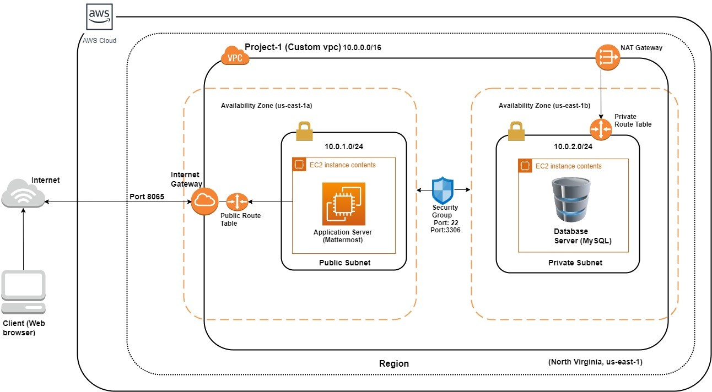
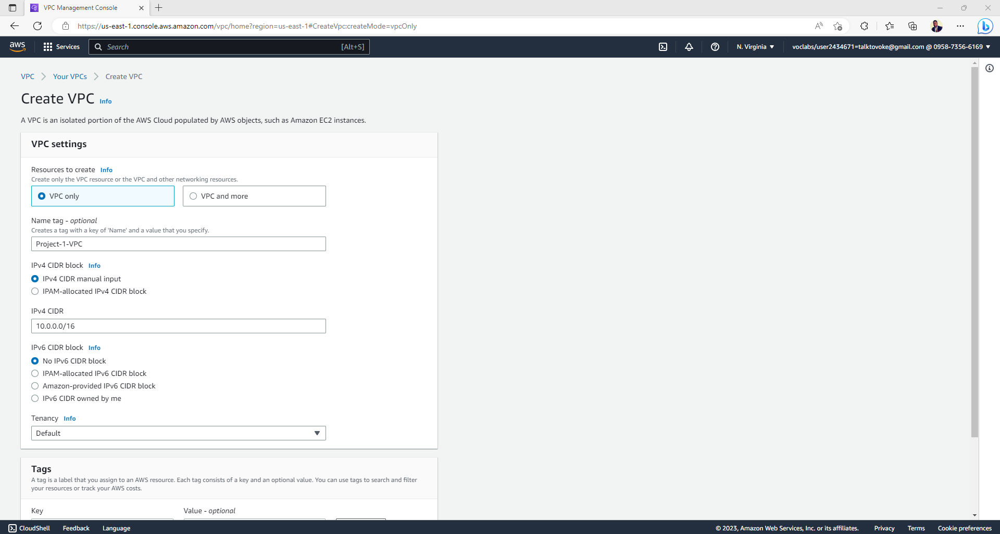
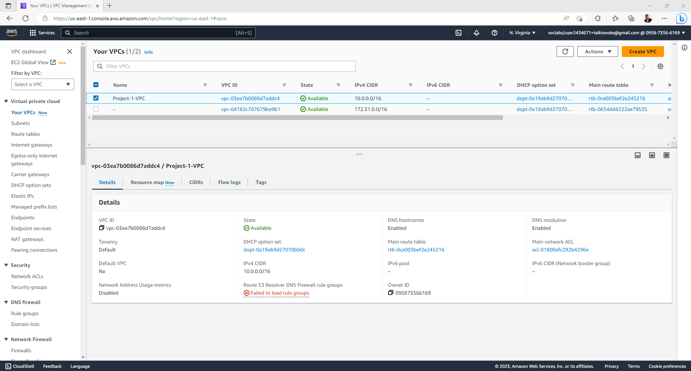
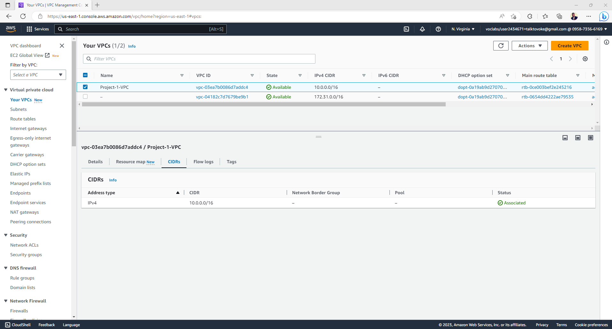

## Scenario: Solving the Team communication and instant messaging problem

Team communication and instant messaging solutions are an integral part of any business environment today. As of 2020, the total number of users of Slack and Microsoft Teams exceeded 20 million. Some organizations might have compliance policies in place which do not allow them to use services managed by third parties. They will prefer solutions that can be managed and hosted on servers controlled by them. The same will extend to communication solutions as well.

---

## 🧰 Architecture diagram

  <!-- Replace with your own GIF or image -->
  

## 🧰 Architecture Implementation
<ul>
  <li>
    
Implement 2 different subnets (one public and the other private) in a custom VP

  </li>
  <li>
    
Install and configure MySQL on an Amazon Linux 2 instance on the private subnet using the instructions provided. (Hint: Use a bastion host and a NAT gateway)

  </li>
  <li>
    
Install and configure Mattermost on an Amazon Linux 2 instance on the public subnet using the provided instructions.

  </li>
   <li>
    
Configure the security groups to allow the ports as shown in the architecture.

  </li>
  <li>
    
 Test the installation by accessing the IP of the public instance in a browser via the port 8065.

  </li>
</ul>

---

## 🧰Step 1 (a): Creation of VPC
<ul>
  <li>
    
Navigate to VPC using the Services button at the top of the screen

  </li>
  <li>
    
Select "Your VPCs" on the left side of the screen

  </li>
  <li>
    
Click on "Create VPC".

  </li>
   <li>
    
Enter the following fields:
            - Name: Project 1 VPC</li>
            - IPv4 CIDR Block: 10.0.0.0/16
            -  The rest of the options can be ignored.

  </li>
  <li>
    
 Select "Create VPC".

  </li>
   <li>
    
 Select the VPC and click on Actions->Edit DNS hostnames.

  </li>
  <li>
    
 Enable DNS hostnames and click on Save.

  </li>

  

  <!-- Replace with your own GIF or image -->
     
     
     

</ul>

