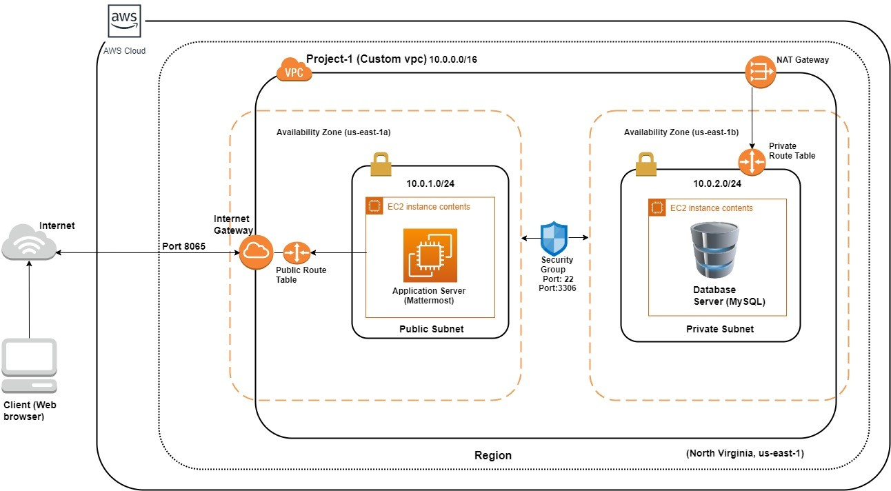
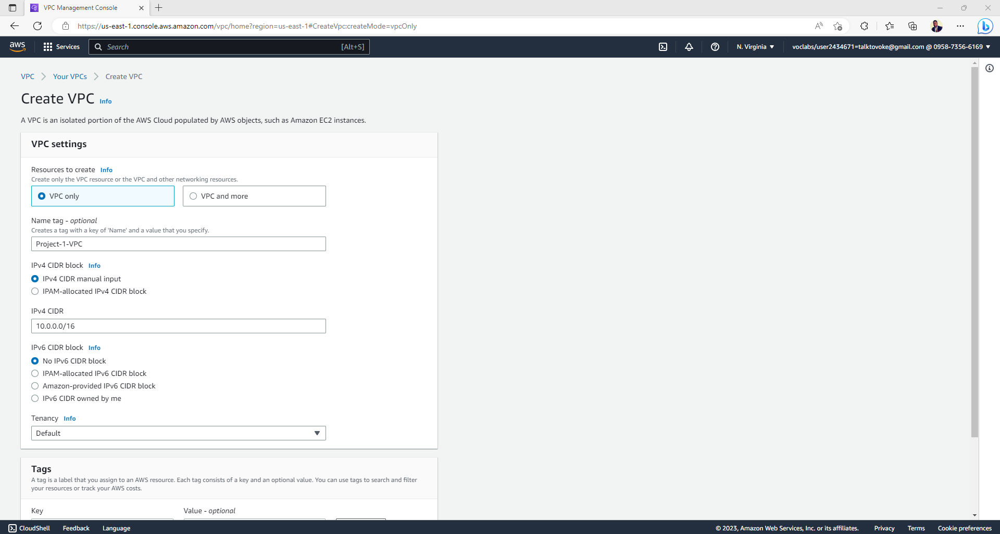
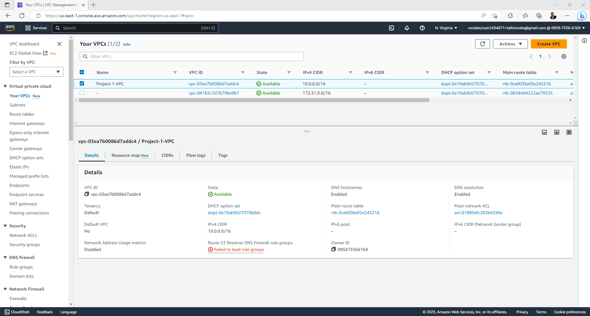
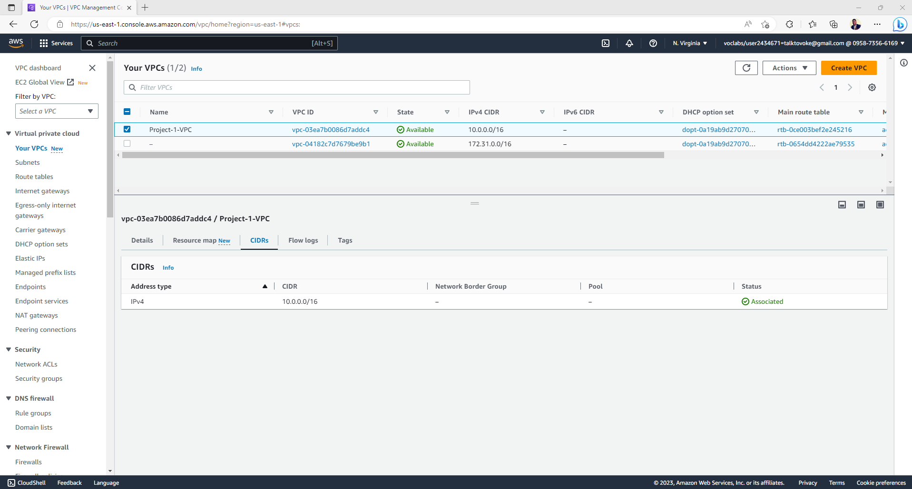
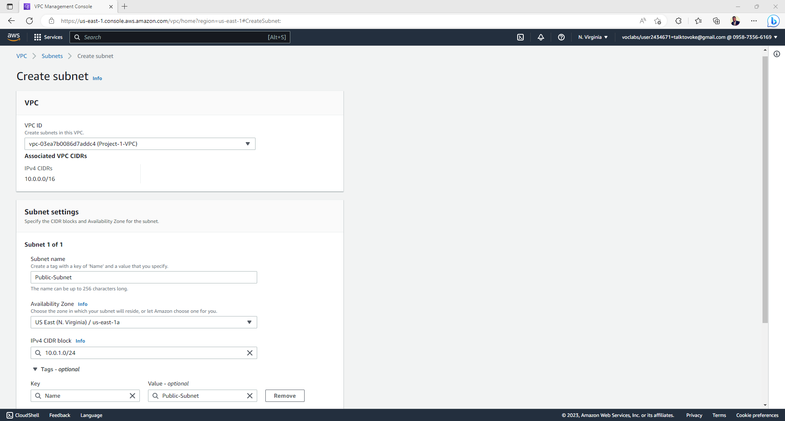
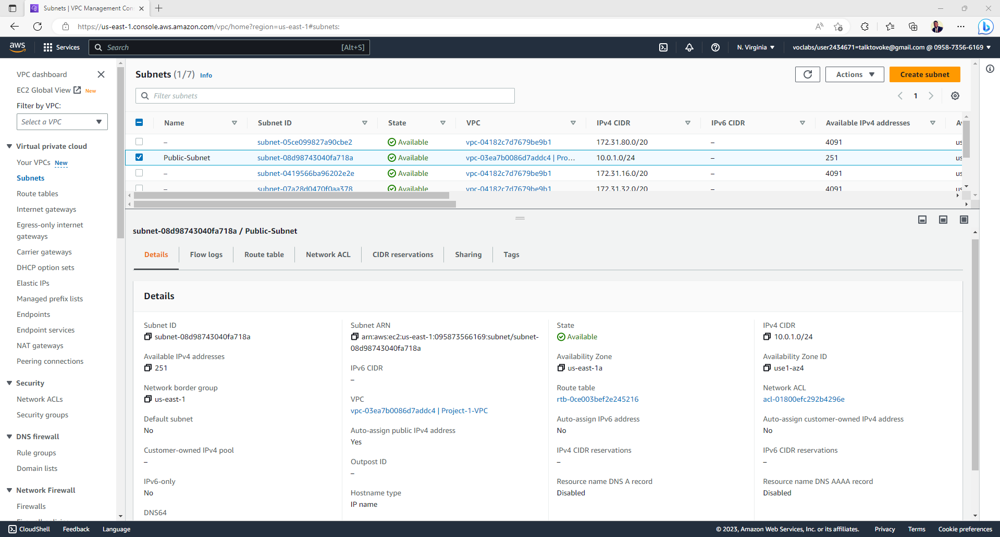

## Scenario: Solving the Team communication and instant messaging problem
<h4>Course: Cloud Computing on AWS</h4>

Implemented a team communication solution using Mattermost and AWS. This is a scalable solution that can be hosted on a public cloud, with its servers, storage etc. completely managed and controlled by an IT team in accordance with a company’s governance and security requirements.

---

## 🧰 Architecture diagram

  <!-- Replace with your own GIF or image -->
  

## 🧰 Architecture Implementation
<ul>
  <li>
    
Implement 2 different subnets (one public and the other private) in a custom VP

  </li>
  <li>
    
Install and configure MySQL on an Amazon Linux 2 instance on the private subnet using the instructions provided. (Hint: Use a bastion host and a NAT gateway)

  </li>
  <li>
    
Install and configure Mattermost on an Amazon Linux 2 instance on the public subnet using the provided instructions.

  </li>
   <li>
    
Configure the security groups to allow the ports as shown in the architecture.

  </li>
  <li>
    
 Test the installation by accessing the IP of the public instance in a browser via the port 8065.

  </li>
</ul>

---

## 🧰Step 1 (a): Creation of VPC
<ul>
  <li>
    
Navigate to VPC using the Services button at the top of the screen

  </li>
  <li>
    
Select "Your VPCs" on the left side of the screen

  </li>
  <li>
    
Click on "Create VPC".

  </li>
   <li>
    
Enter the following fields:
            - Name: Project 1 VPC</li>
            - IPv4 CIDR Block: 10.0.0.0/16
            -  The rest of the options can be ignored.

  </li>
  <li>
    
 Select "Create VPC".

  </li>
   <li>
    
 Select the VPC and click on Actions->Edit DNS hostnames.

  </li>
  <li>
    
 Enable DNS hostnames and click on Save.

  </li>

  

  <!-- Replace with your own GIF or image -->
     
     
     

</ul>

## 🧰Step 1 (b): Creation of Public Subnet
<ul>
  <li>
    
Navigate to VPC -> Subnets

  </li>
  <li>
    
Click on "Create Subnet"

  </li>
   <li>
    
Enter the following fields:
            - Name: Public Subnet</li>
            - VPC: Select the Project 1 VPC</li>  
            - IPv4 CIDR Block: 10.0.1.0/24
            -  The rest of the options can be ignored.

  </li>
  <li>
    
 Click on "Create".

  </li>
   <li>
    
 Once the subnet has been created, select the subnet, and click on Actions->Modify Auto-assign IP settings.

  </li>
  <li>
    
 Enable the option "Auto assign IPv4" and select Save.

  </li>

  

  <!-- Replace with your own GIF or image -->
     
     
<!--       -->

</ul>

### 🛠️ Skills & Tools Covered

  
   
  
   
   
   
  

